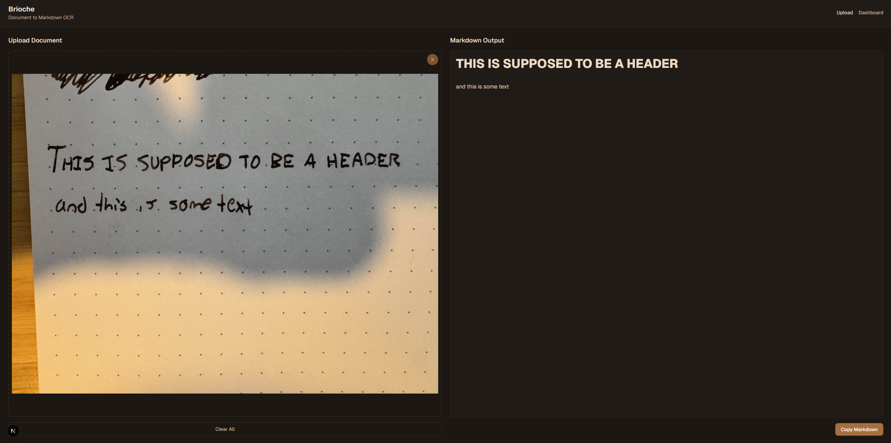
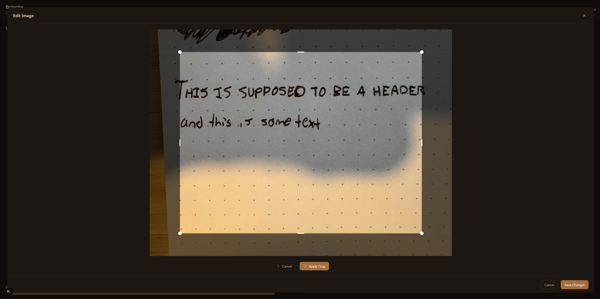
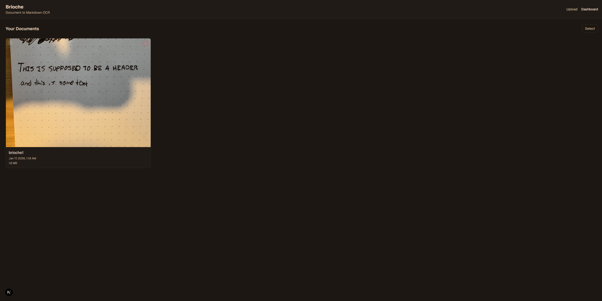

# Brioche
A self-hosted tool for converting documents into markdown via Gemini's OCR capabilities.

## Reasoning
I will start by saying yes this was mostly written by AI and has a few bugs. I enjoy using AI for creating tools that I want but don't feel like writing all myself. Are there alternatives? Yes. Is it cooler to have a tool of your own? Also yes. Shoutout Claude!

## Features
- Stores data in IndexedDB. No server required, so it's easy to deploy
- Basic image editing capabilities such as cropping and rotation

## Running locally
- Clone the project
- Install dependencies with `bun i`
- Add a `GOOGLE_GENERATIVE_AI_API_KEY` environment variable
- Start the dev server with `bun run dev`

## Screenshots

